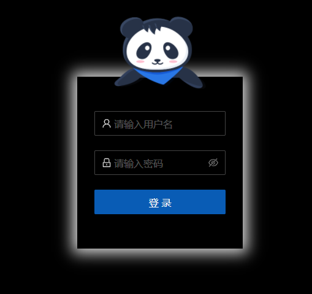
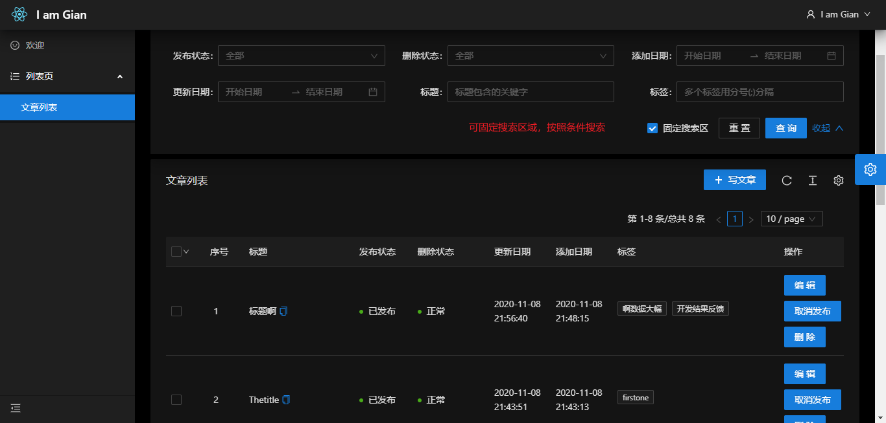
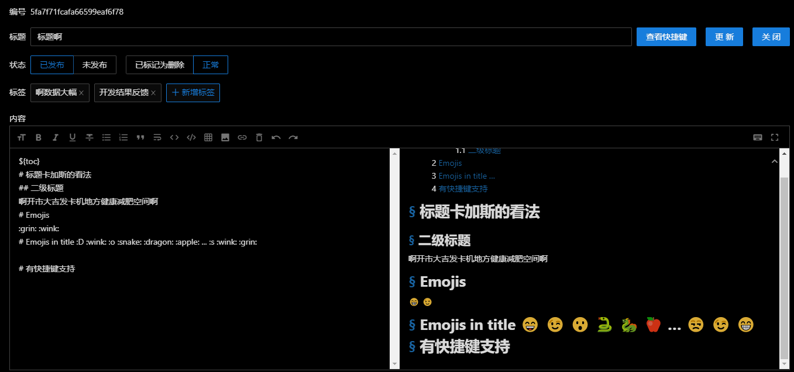
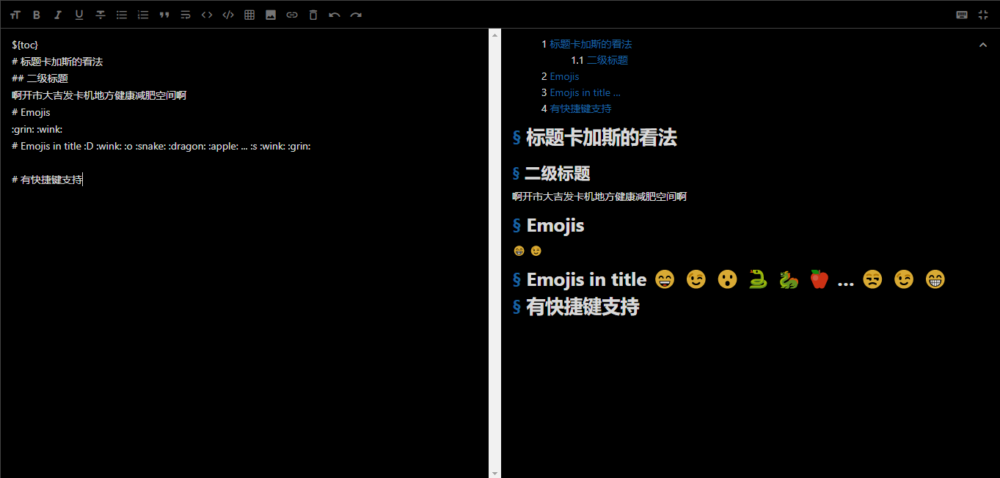
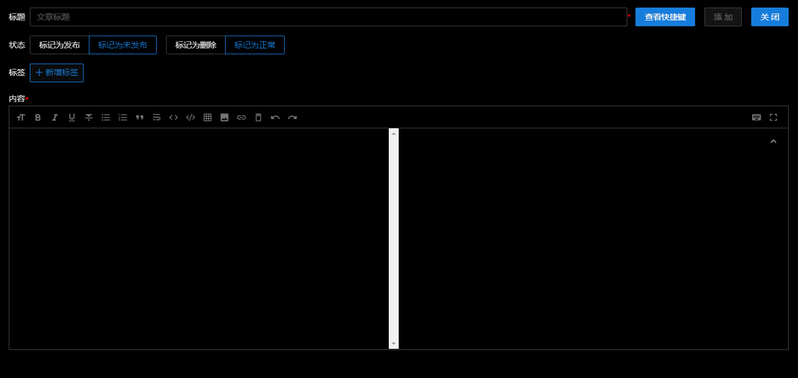
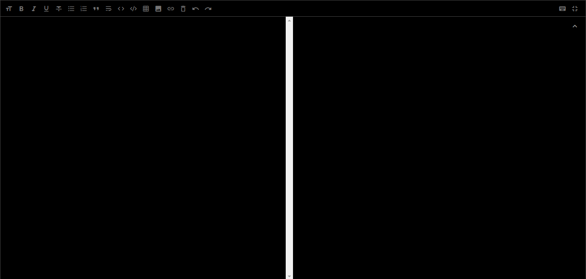

# Gian 个人博客管理端

         

# 欢迎 😁start，fork，watch⭐~

## 效果图(多图预警!!!)

登录效果图



列表页效果图



编辑效果图



全屏编辑效果图



添加效果图



全屏添加效果图



## 技术栈

- typescript
- mobx
- craco
- react
- react-router-dom
- antd
- graphql
- highlight.js
- markdown-it
- less

## 开发步骤

1. 安装本项目依赖的 API 项目或者自行开发
2. 打开命令行终端并进入项目根目录
3. 创建.env.local 文件 `cp .env.local.template .env.local`
4. 更新.env.local 文件中的环境变量：

   GENERATE_SOURCEMAP=true(production 环境下最好为 false)

   REACT_APP_API_HOST=运行 API 的主机 IP

   REACT_APP_API_PORT=API 运行端口

   REACT_APP_CLIENT_ID=API 端配置的客户端编号

   REACT_APP_CLIENT_SECRET=API 端配置的客户端密钥

5. 安装项目依赖,终端里运行 `npm i` or `yarn`
6. 开始吧 😁,终端里运行 `npm run dev` or `yarn run dev`

## 生产模式下运行

`npm run build && npm run start` or `yarn run build && yarn run start`

## pm2 部署

```bash
bash start.sh
```
